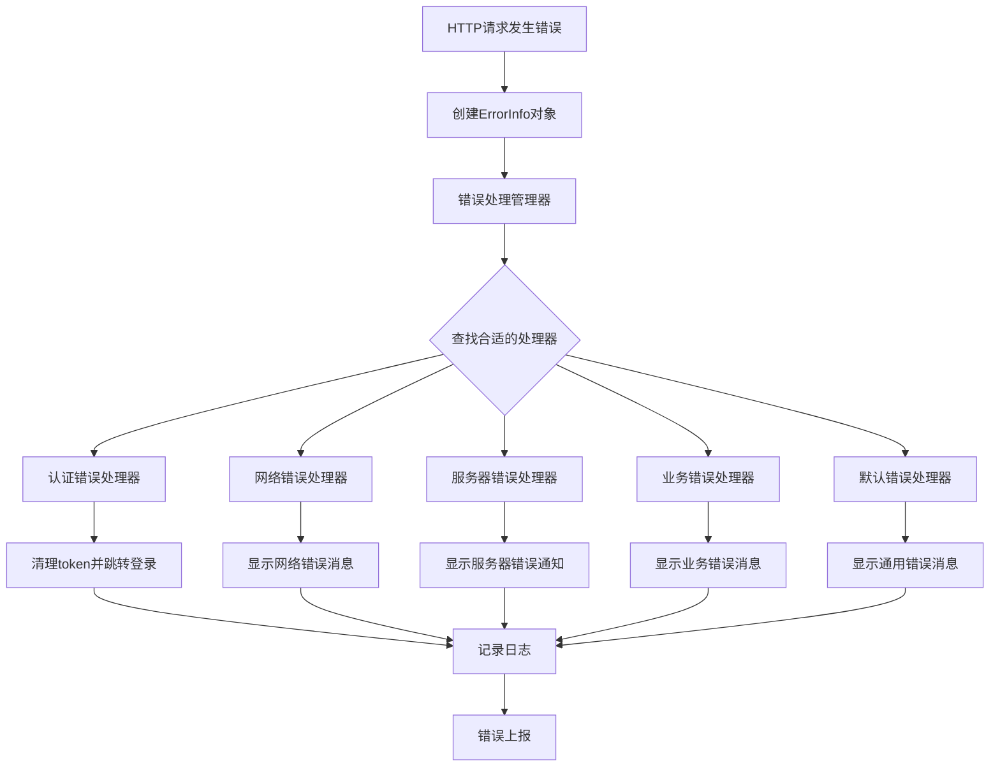

# 统一错误处理机制使用指南

## 概述

本项目实现了统一的错误处理机制，解决了原有代码中错误处理逻辑重复、缺乏统一策略的问题。新的错误处理系统提供了可扩展、可配置的错误处理能力。

## 核心特性

### 1. 统一的错误分类
- **网络错误** (NETWORK_ERROR): 网络连接失败、超时等
- **认证错误** (AUTH_ERROR): token过期、未授权等
- **业务错误** (BUSINESS_ERROR): 业务逻辑错误
- **服务器错误** (SERVER_ERROR): 5xx状态码错误
- **参数验证错误** (VALIDATION_ERROR): 4xx状态码错误
- **未知错误** (UNKNOWN_ERROR): 其他未分类错误

### 2. 可扩展的处理器架构
- 基于优先级的处理器链
- 支持自定义错误处理器
- 每种错误类型都有专门的处理器

### 3. 环境相关的配置
- 开发环境：详细日志输出，不上报错误
- 生产环境：简化日志，自动错误上报
- 测试环境：静默模式，便于自动化测试

## 文件结构

```
src/
├── types/
│   └── error.ts              # 错误类型定义
├── utils/
│   ├── authUtils.ts          # 认证相关工具函数
│   ├── errorHandler.ts       # 统一错误处理器
│   ├── errorConfig.ts        # 错误处理配置
│   └── http.ts              # HTTP客户端（已重构）
```

## 使用方法

### 1. 在HTTP请求中自动处理错误

```typescript
import http from '@/utils/http'

// 错误会被自动处理，无需手动处理
try {
  const data = await http.get('/api/users')
  console.log(data)
} catch (error) {
  // 错误已经被统一处理（显示消息、记录日志等）
  // 这里只需要处理业务逻辑
}
```

### 2. 手动处理特定错误

```typescript
import { processError } from '@/utils/errorHandler'
import { ErrorType, ErrorLevel } from '@/types/error'

// 创建自定义错误信息
const errorInfo = {
  type: ErrorType.BUSINESS_ERROR,
  code: 'CUSTOM_ERROR',
  message: '自定义错误消息',
  level: ErrorLevel.ERROR,
  timestamp: Date.now()
}

// 处理错误
await processError(errorInfo, {
  showMessage: true,
  customMessage: '操作失败，请重试'
})
```

### 3. 注册自定义错误处理器

```typescript
import { registerErrorHandler } from '@/utils/errorHandler'
import type { IErrorHandler, ErrorInfo } from '@/types/error'

class CustomErrorHandler implements IErrorHandler {
  priority = 150 // 高优先级

  canHandle(error: ErrorInfo): boolean {
    return error.code === 'CUSTOM_BUSINESS_ERROR'
  }

  async handle(error: ErrorInfo): Promise<void> {
    // 自定义处理逻辑
    console.log('处理自定义业务错误:', error)
    // 显示自定义UI
    // 执行特定的恢复操作
  }
}

// 注册处理器
registerErrorHandler(new CustomErrorHandler())
```

### 4. 配置错误处理行为

```typescript
import { processError } from '@/utils/errorHandler'

// 使用自定义配置处理错误
await processError(error, {
  showMessage: false,        // 不显示错误消息
  logError: true,           // 记录错误日志
  reportError: true,        // 上报错误
  customMessage: '自定义消息',
  retryCount: 2,            // 重试次数
  retryDelay: 3000,         // 重试延迟
  autoRetry: true           // 自动重试
})
```

## 错误处理流程



## 配置选项

### 环境配置

| 环境 | 显示消息 | 记录日志 | 错误上报 | 重试 |
|------|----------|----------|----------|------|
| 开发 | ✅ | ✅ | ❌ | ❌ |
| 测试 | ❌ | ✅ | ❌ | ❌ |
| 生产 | ✅ | ❌ | ✅ | ✅ |

### 错误类型配置

| 错误类型 | 默认消息 | 支持重试 | 自动上报 |
|----------|----------|----------|----------|
| 网络错误 | 网络连接失败 | ✅ | ✅ |
| 认证错误 | 登录已过期 | ❌ | ✅ |
| 服务器错误 | 服务器错误 | ✅ | ✅ |
| 业务错误 | 操作失败 | ❌ | 生产环境 |
| 验证错误 | 参数错误 | ❌ | ❌ |

## 最佳实践

### 1. 错误处理器优先级
- 认证错误处理器: 100
- 网络错误处理器: 90
- 服务器错误处理器: 80
- 业务错误处理器: 70
- 验证错误处理器: 60
- 自定义处理器: 50-150
- 默认处理器: 0

### 2. 错误消息设计
- 用户友好：避免技术术语
- 可操作：提供解决建议
- 一致性：使用统一的语言风格
- 国际化：支持多语言

### 3. 错误日志记录
- 包含完整的上下文信息
- 记录用户操作路径
- 包含错误堆栈信息
- 便于问题排查和分析

### 4. 错误恢复策略
- 自动重试：适用于临时性错误
- 降级处理：提供备选方案
- 用户引导：提供手动恢复选项
- 状态恢复：确保应用状态一致性

## 扩展指南

### 添加新的错误类型

1. 在 `types/error.ts` 中添加新的错误类型
2. 在 `errorConfig.ts` 中添加对应的配置
3. 创建专门的错误处理器
4. 注册到错误处理管理器

### 自定义错误上报

```typescript
// 实现自定义错误上报逻辑
class CustomErrorReporter {
  async report(error: ErrorInfo): Promise<void> {
    // 发送到监控系统
    await fetch('/api/errors/report', {
      method: 'POST',
      body: JSON.stringify(error)
    })
  }
}
```

### 错误重试机制

```typescript
// 实现指数退避重试
class RetryManager {
  async retry<T>(
    operation: () => Promise<T>,
    maxRetries: number = 3,
    baseDelay: number = 1000
  ): Promise<T> {
    for (let i = 0; i < maxRetries; i++) {
      try {
        return await operation()
      } catch (error) {
        if (i === maxRetries - 1) throw error
        await this.delay(baseDelay * Math.pow(2, i))
      }
    }
    throw new Error('重试失败')
  }

  private delay(ms: number): Promise<void> {
    return new Promise(resolve => setTimeout(resolve, ms))
  }
}
```

## 故障排除

### 常见问题

1. **错误处理器不生效**
   - 检查处理器优先级
   - 确认 `canHandle` 方法逻辑
   - 验证错误类型匹配

2. **错误消息不显示**
   - 检查环境配置
   - 确认 `showMessage` 配置
   - 验证 Element Plus 是否正确引入

3. **错误上报失败**
   - 检查网络连接
   - 验证上报URL配置
   - 确认服务端接口可用

### 调试技巧

1. 开启详细日志
2. 使用浏览器开发者工具
3. 检查网络请求
4. 验证错误处理器执行顺序

## 性能考虑

- 错误处理器按优先级排序，避免不必要的检查
- 异步处理错误上报，不阻塞主流程
- 批量上报错误，减少网络请求
- 限制错误上报频率，避免过载

## 安全考虑

- 生产环境不暴露敏感错误信息
- 错误日志脱敏处理
- 防止错误信息泄露系统架构
- 限制错误上报数据量